# Basic Pentesting 1 - Walkthrough

### TL;DR

- `ProFTPD 1.3.3c`<- metasploit backdoor RCE
- Wordpress at `/secret/` with `admin:admin` <- metasploit `wp_login` shell upload
- `marlinspike` user password in `/etc/shadow` <- crack using `john`
- run `sudo su` as `marlinspike`
- write into `/etc/passwd` as `www-data` to change the `root` password

## Intro

According to its creator, _Basic Pentesting 1_ is a small boot2root VM intended for newcomers to penetration testing. Indeed, this is probably the **simplest** machine I have ever tried and I can only recommend it to all newbies.

More info and download link can be found [here](https://www.vulnhub.com/entry/basic-pentesting-1,216/).

## Enumeration

Let's start by enumerating open TCP ports using `nmap -A 192.168.0.24`.

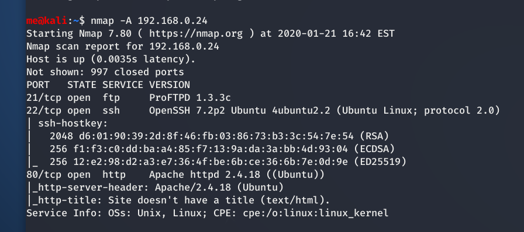

`-A` (which stands for _aggressive_) enables OS detection, version detection, script scanning, and traceroute

We can see 3 open ports:
- port `21` running `ProFTPD 1.3.3c`
- port `22` running `OpenSSH 7.2p2`
- port `80` running `Apache httpd 2.4.18`

## Exploitation

### Port 21 - ProFTPD 1.3.3c

Searching for `ProFTPD` in metasploit, we find an exploit `exploit/unix/ftp/proftpd_133c_backdoor` exactly for our version.

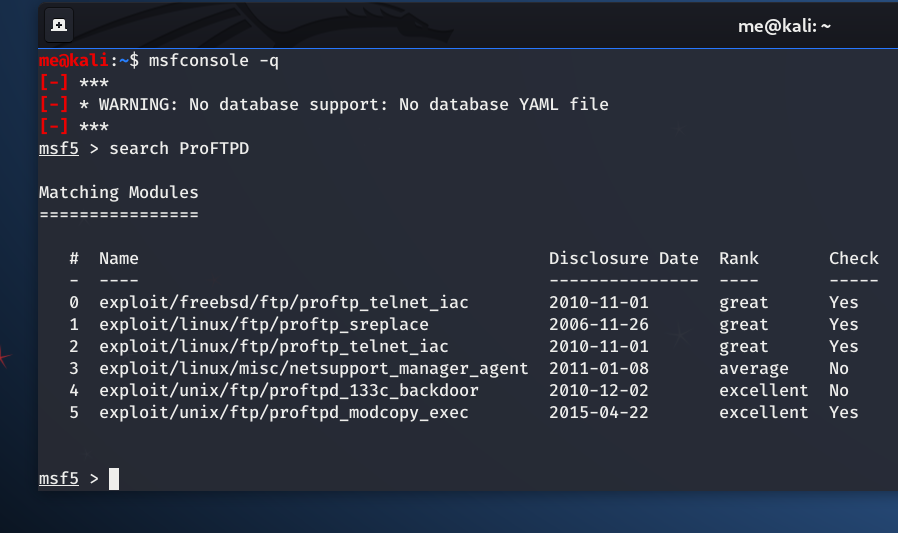

From there, it is pretty straightforward: use the exploit we have found, set remote host to the target machine IP and run the exploit.

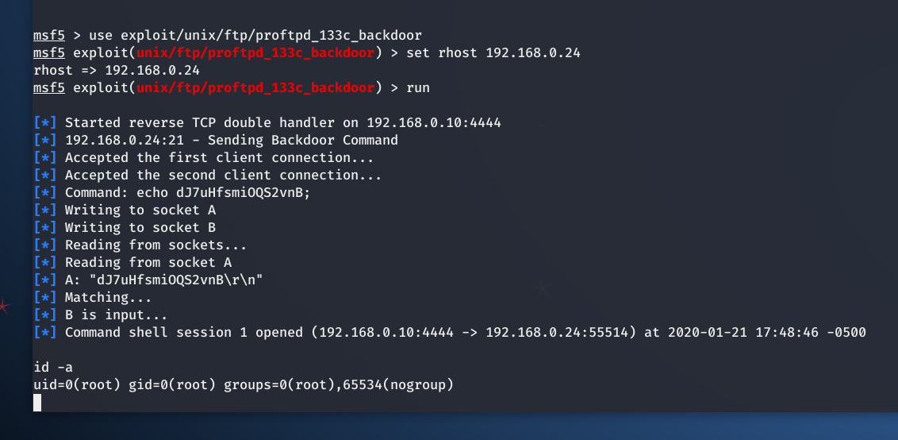

Issuing `id -a` or `whoami` command we can see that we have **root** access. Target pwned!

However, there is an even easier and more elegant way of exploiting this vulnerability! And it comes with a nice little story.

According to a [wiki page about the exploit](https://www.aldeid.com/wiki/Exploits/proftpd-1.3.3c-backdoor), this is how the vulnerability was born:

>The attackers most likely used an unpatched security issue in the FTP daemon to gain access to the server and used their privileges to replace the source files for ProFTPD 1.3.3c with a version which contained a **backdoor**.

If we take a look at the actual code of the [metasploit module](https://www.exploit-db.com/exploits/16921), we can actually see where the backdoor is.

```ruby
def exploit

		connect

		print_status("Sending Backdoor Command")
		sock.put("HELP ACIDBITCHEZ\r\n")

		res = sock.get_once(-1,10)
```

The backdoor can be invoked by simply connecting to port `21` via `telnet` or `netcat` and sending the string `HELP ACIDBITCHEZ`.

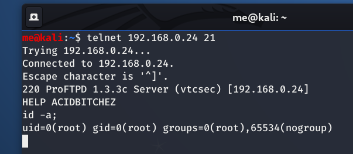

### Port 80 - Apache httpd 2.4.18

Visiting the URL of the target machine `http://192.168.0.24` in the browser we can take a look at what the port `80` has to offer.

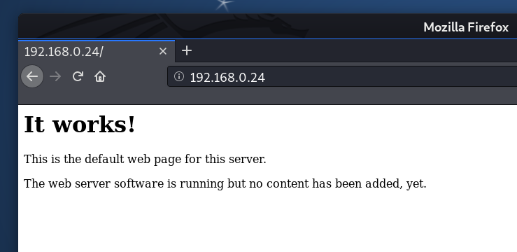

Since there doesn't seem to be anything else on the page, we use `dirb` to discover some more web content.

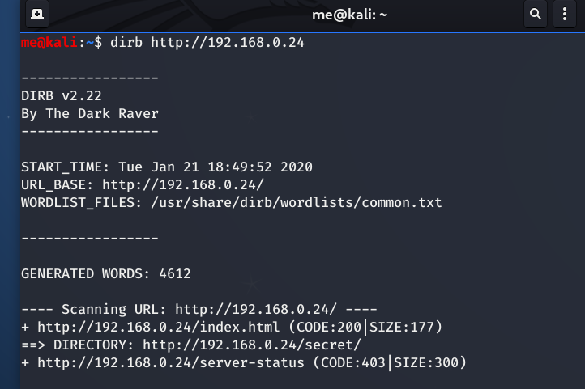

`dirb` has found a directory called `secret` so let's take a look at what is there.

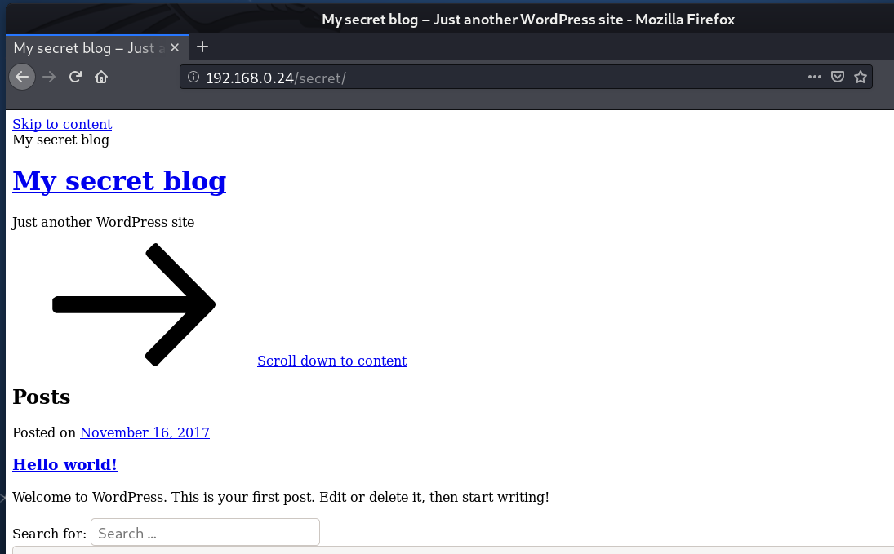

It looks like a **WordPress blog**, but all the graphics seem to be missing. If we take a look at the network console in the browser (_Ctrl+Shift+E_ in Firefox), we can see that the page is trying to load some resources from the domain called `vtcsec`. This is a common issue in Vulnhub labs and can be easily fixed by mapping the domain (`vtcsec` in this case) to the IP of the target machine. We do this by issuing the following command on our Kali machine:
- `echo "192.168.0.24 vtcsec" >> /etc/hosts` (use your own target IP, of course)
- _NOTE:_ in case you are not a root, use `sudo bash -c 'echo "192.168.0.24 vtcsec" >> /etc/hosts'` instead

Now, the page looks much nicer (not that it actually mattered in the exploitation).

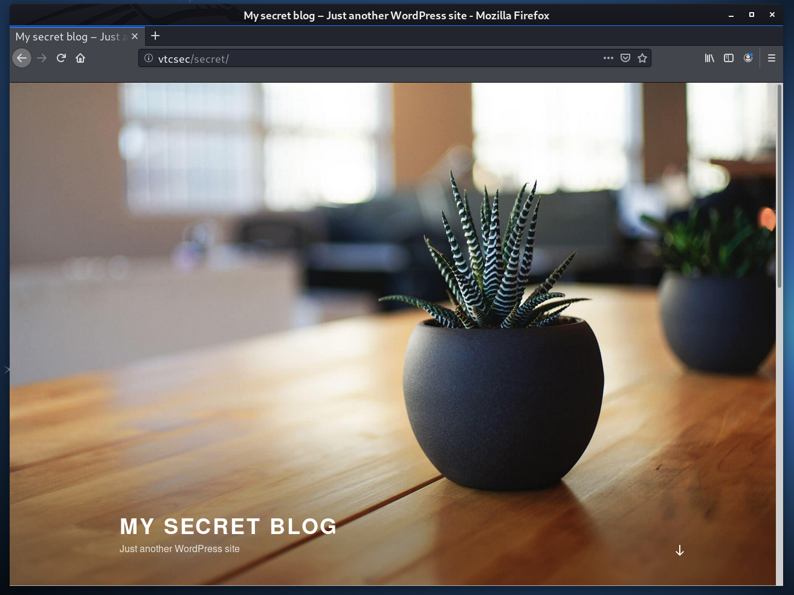

Now, let's take a look if the login page is available. By default it is located at `wp-login.php`, which is also the case here. Trying some default credentials, we found that user `admin` has a password `admin`! Lucky guess...

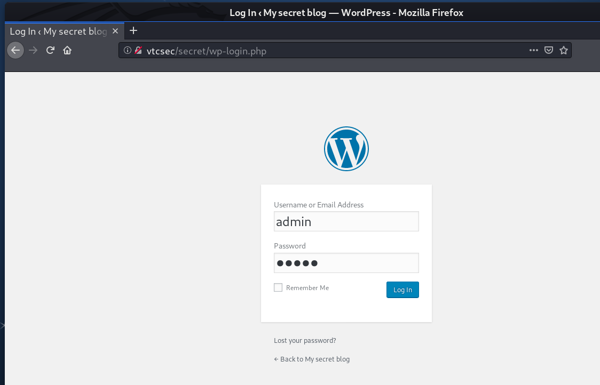

Since we are now logged in as `admin`, we can upload a `PHP` file to gain a shell on the server. The easiest way to do this is to use metasploit module `exploit/unix/webapp/wp_admin_shell_upload`. First, take a look at what parameters we need to set:

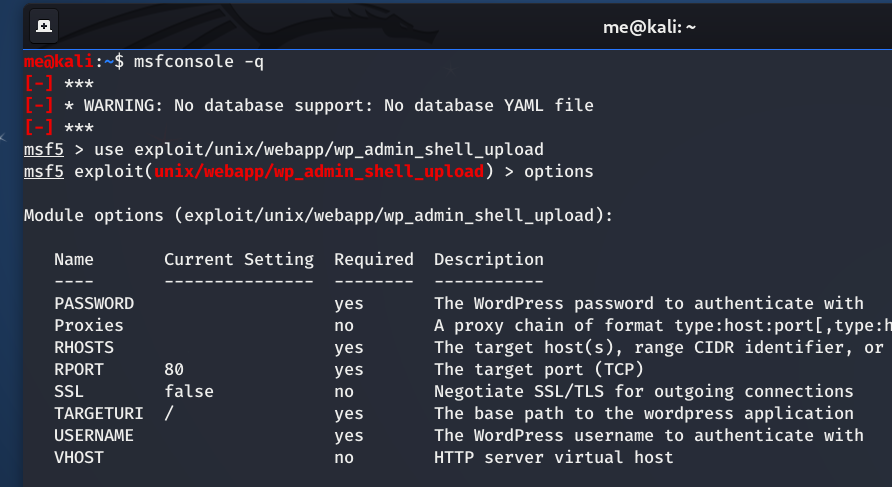

- `set RHOST vtcsec` - set the target host
- `set TARGETURI /secret/` - set the path to the wordpress
- `set USERNAME admin` - set the username to log in as
- `set PASSWORD admin` - set the password for the user

Now we just `run` the exploit and a meterpreter session should be created. In meterpreter we type `shell` to drop into the system command shell. Once in system shell, we take a look at the current user info.

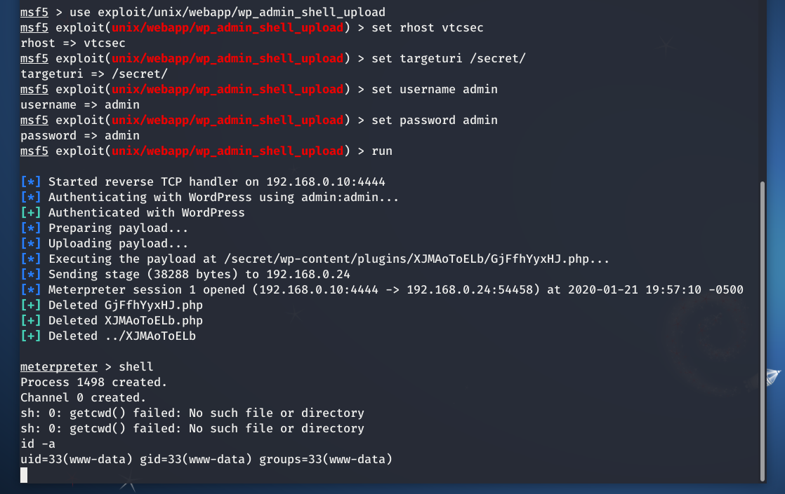

#### Privilege escalation path #1

We have shell as `www-data` user. Let's try to escalate our privileges to the `root` user.

First, to make the shell more pretty, we can issue `python -c 'import pty; pty.spawn("/bin/bash")'`.

First thing to look at is always the `/etc/passwd` file to see what other users are on the system. Aside from a number of service accounts, there is a user called `marlinspike` (a reference to a well-known security researcher [Moxie Marlinspike](https://en.wikipedia.org/wiki/Moxie_Marlinspike)).

```bash
www-data@vtcsec:/etc$ cat /etc/passwd
root:x:0:0:root:/root:/bin/bash
...
marlinspike:x:1000:1000:marlinspike,,,:/home/marlinspike:/bin/bash
...
```

Another interesting file is `/etc/shadow` which sometimes contain user password. Normally, it is accessible only to the `root` but in this case the permissions are misconfigured and we are able to read it as well.

```bash
www-data@vtcsec:/etc$ cat /etc/shadow
cat /etc/shadow
root:!:17484:0:99999:7:::
...
marlinspike:$6$wQb5nV3T$xB2WO/jOkbn4t1RUILrckw69LR/0EMtUbFFCYpM3MUHVmtyYW9.ov/aszTpWhLaC2x6Fvy5tpUUxQbUhCKbl4/:17484:0:99999:7:::
...
```

Inside, we find a hashed password for the `marlinspike` user. We can try using `john` tool to crack the hash.

First, we copy the whole line from `/etc/shadow` corresponding to `marlinspike` to a new file (in the Kali box). Then, we just run `john` and supply the file name as a parameter.

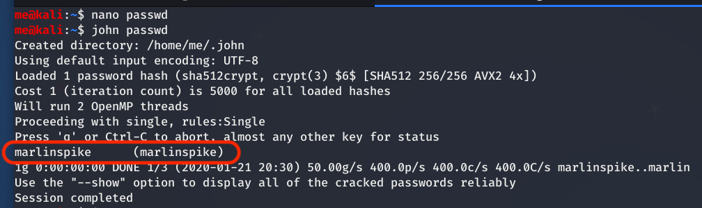

`john` has successfully cracked the password hash, which is actually same as the username - `marlinspike`.

We can now log in using SSH as `marlinspike` with the password `marlinspike`.

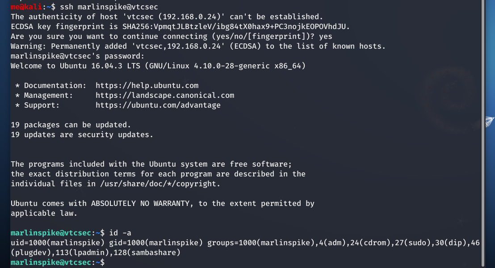

To see the list of commands that `marlinspike` can run as `sudo`, we can use `sudo -l`.

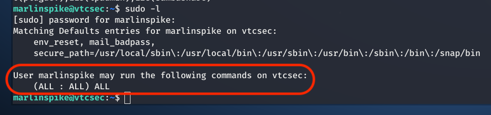

This means we can run any command as `sudo`, which includes command `su` - switch user.

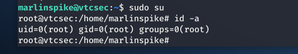

BINGO! We have a **second root shell!**

#### Privilege escalation path #2

Coming back to the `www-data` user, we can also notice that we have write access to the `/etc/passwd` file.

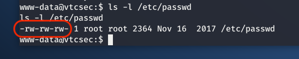Historically, `/etc/passwd` file used to store user passwords as well. This is no longer the case for security reasons. However, _if_ `/etc/passwd` contains a user password (hash) it _will_ be used for authentication.

Based on this theory, we can try editing the line for the `root` user in `/etc/passwd` file to contain hash of a password that we know. We can generate the hash e.g. using this Perl command
- `perl -le 'print crypt("mypass","mysalt")'`

which will return the  string `myDUAMR/WMo7.`.

_NOTE:_ Despite its name, _crypt_ function does not actually do any encryption. It is only a simple one-way hash function.

Since we don't have a fully interactive shell under the `www-data` user, we can't use `nano` or `vim` to edit files. We can try using `sed` stream editor, but there is a simpler although a bit dirty way to do this.

Instead of editing the file, we can just replace the whole content using the `echo` and redirecting the output to the `passwd` file.
- `echo "root:myDUAMR/WMo7.:0:0:root:/root:/bin/bash" > /etc/passwd`

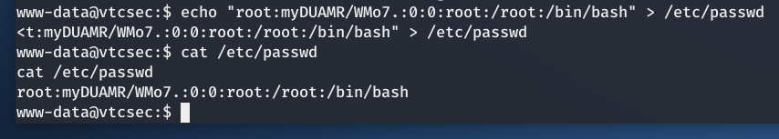

**CAREFUL!** Don't do this on your Kali machine or any production device. This will seemingly delete all other users on the system.

If we now try switching the user to `root` with `su root`, the system will complain that it cannot determine your user name. Indeed, according to `/etc/passwd` it looks like `www-data` does not exist now.

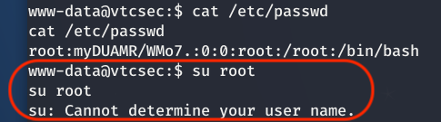

To fix it, we just need to add line for `www-data` back to `/etc/passwd` file.

- `echo "www-data:x:33:33:www-data:/var/www:/usr/sbin/nologin" >> /etc/passwd`

Note the difference between `>` and `>>`. The `>` overwrites the whole content of the file, while `>>` only appends at the end of the file.

Try switching to `root` with the password `mypass` now and it works! We have a **third root shell!**

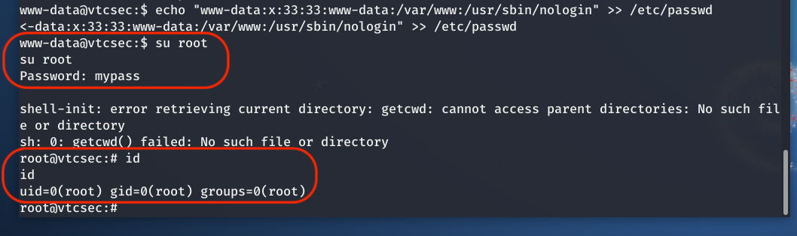


## Conclusion

_Basic pentesting 1_ is the best machine if you are just starting with penetration testing. I hope you found this walkthrough to be helpful.

_--CyberSecWTF--_
